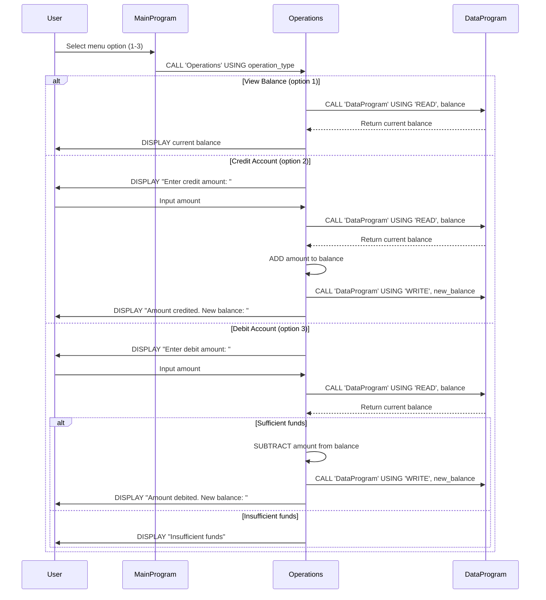

# COBOL Student Account Management System

This project implements a simple student account management system using COBOL. The system allows users to view account balances, credit accounts, and debit accounts with basic business rules.

## Project Structure

The COBOL source files are located in the `src/cobol/` directory:

- `data.cob`: Data storage and retrieval module
- `main.cob`: Main program with user interface
- `operations.cob`: Business logic for account operations

## File Descriptions

### data.cob
**Purpose**: Handles persistent storage and retrieval of account balance data.

**Key Functions**:
- Stores the current account balance in working storage
- Provides read/write operations for balance data
- Initializes balance to $1000.00

**Technical Details**:
- Uses linkage section for parameter passing
- Supports 'READ' and 'WRITE' operations
- Balance stored as PIC 9(6)V99 (up to $999999.99)

### main.cob
**Purpose**: Provides the main user interface and program flow control.

**Key Functions**:
- Displays a menu-driven interface
- Handles user input for operation selection
- Calls appropriate operations based on user choice
- Manages program loop until user chooses to exit

**Menu Options**:
1. View Balance
2. Credit Account
3. Debit Account
4. Exit

### operations.cob
**Purpose**: Implements the core business logic for account operations.

**Key Functions**:
- **View Balance (TOTAL)**: Retrieves and displays current balance
- **Credit Account**: Adds specified amount to balance
- **Debit Account**: Subtracts specified amount from balance (with validation)

## Business Rules

### Student Account Rules
1. **Initial Balance**: All student accounts start with a balance of $1000.00
2. **Credit Operations**: Any positive amount can be credited to the account
3. **Debit Operations**:
   - Debit amounts must be less than or equal to current balance
   - Insufficient funds prevent debit transactions
   - Error message displayed for failed debit attempts
4. **Balance Limits**: Maximum balance supported is $999999.99
5. **Data Persistence**: Balance changes are stored and persist across operations

### Validation Rules
- Debit transactions require sufficient funds
- Invalid menu choices are rejected with error messages
- Amount inputs are expected in decimal format (e.g., 100.50)

## Usage

To run the system:
1. Compile the COBOL programs
2. Execute the main program
3. Follow the menu prompts to perform account operations

## Dependencies

- COBOL compiler (e.g., GnuCOBOL)
- Terminal environment for interactive input/output

## Sequence Diagram

The following sequence diagram illustrates the data flow for account operations in the system:

